# Proyecto: TripLife
TripLife es una red social para viajeros creada para compartir y recordar tus historias, fotos y tips con otros viajeros que disfrutan vivir a través de los viajes. 

Demo: https://triplife-c3b62.web.app/

>*“La **vida** es un **viaje** que vale la pena **compartir**.”*

## Aplicación

Esta single page app (SPA) implementada con javascript y firebase, es una aplicación creada para aquellas personas que viajan por largas temporadas como parte de su estilo de vida y no solo en temporada vacacional, para quienes se incorporan a las costumbres y cultura, y que buscan conocer más que solo los lugares emblemáticos de una región.    

Necesidades del usuario:

- Registrarse con facebook o google.
- Compartir y recomendar nuevos lugares.
- Compartir el momento más significativo del lugar en el que se encuentre.
- Elegir quién puede ver lo que comparte.
- Conocer nuevos lugares a través de otros viajeros.
- Reaccionar a los momentos que más le gusten de otros viajeros.

## Proceso creativo

### Sketch

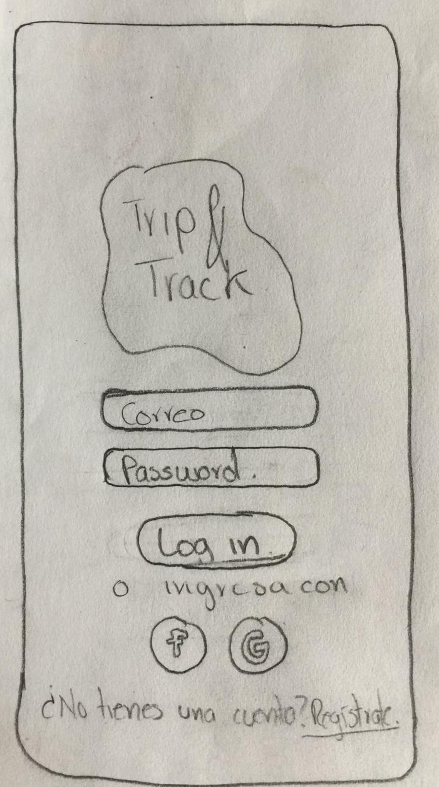
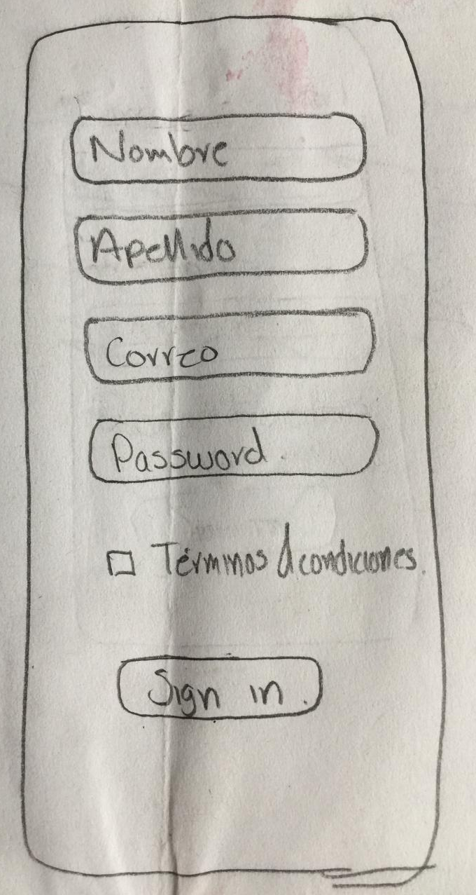
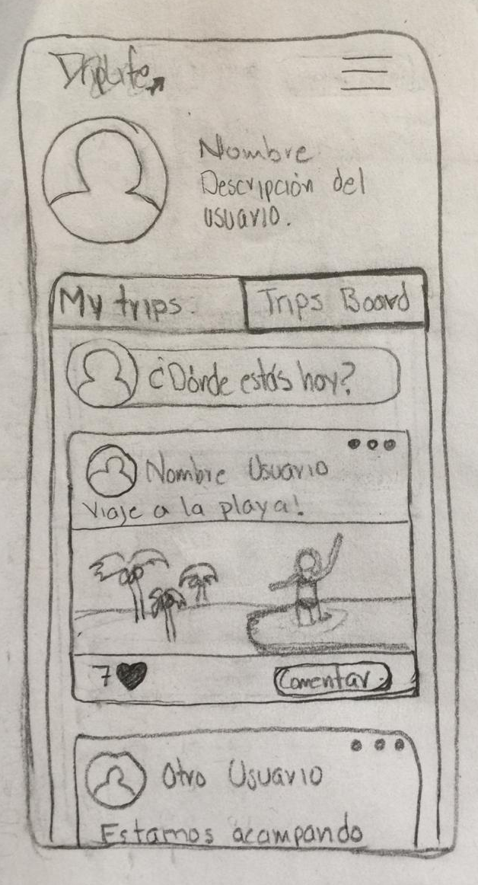
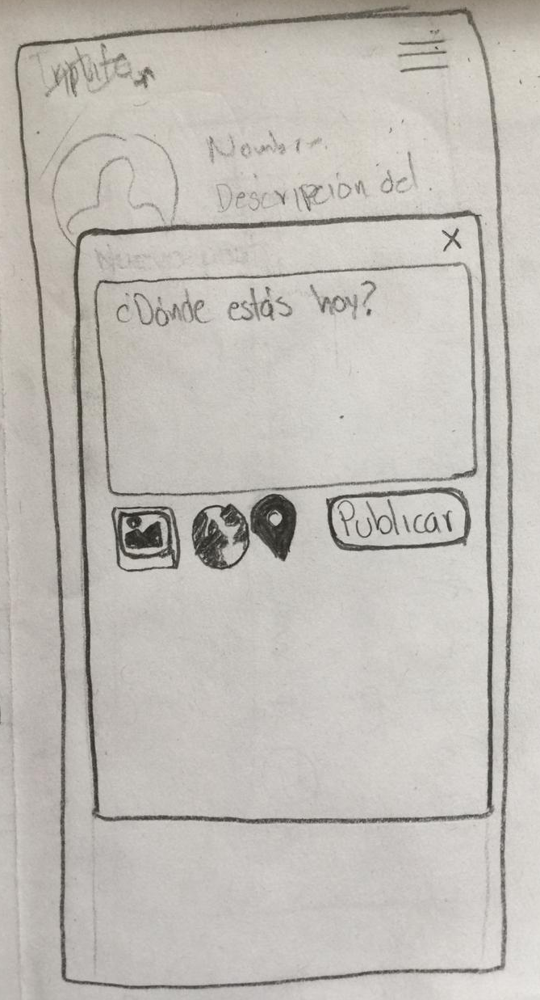

### Mockup

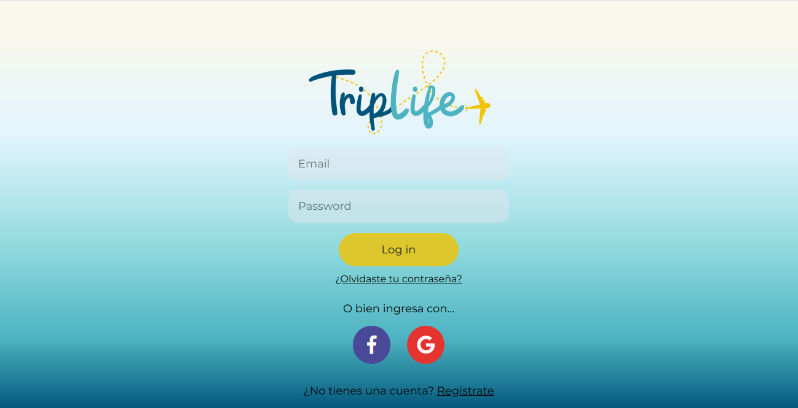
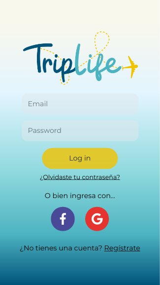
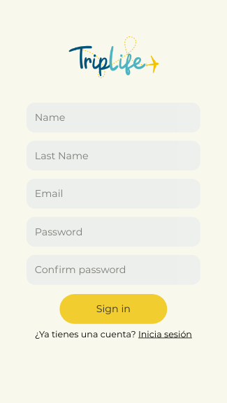

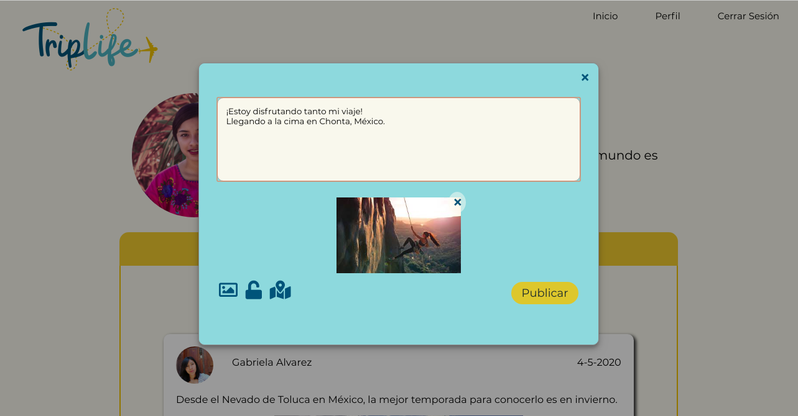
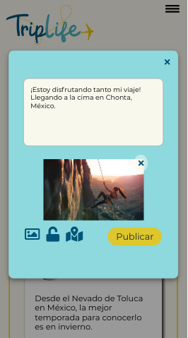

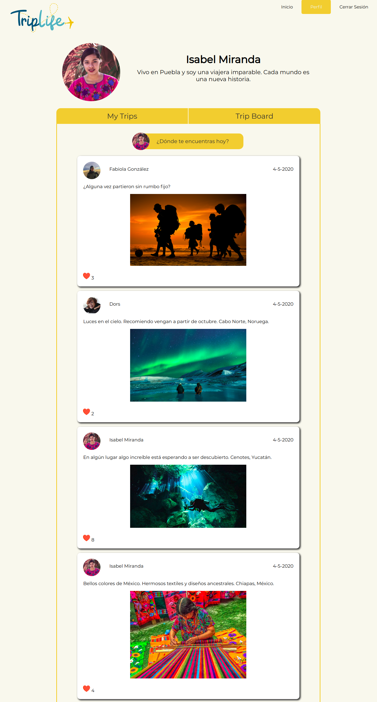
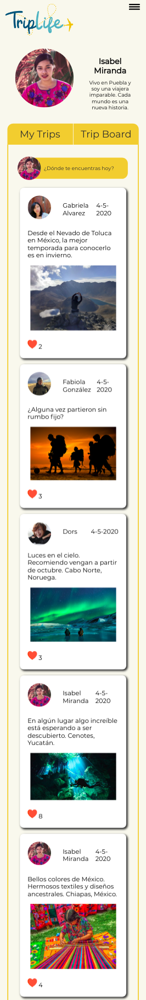  
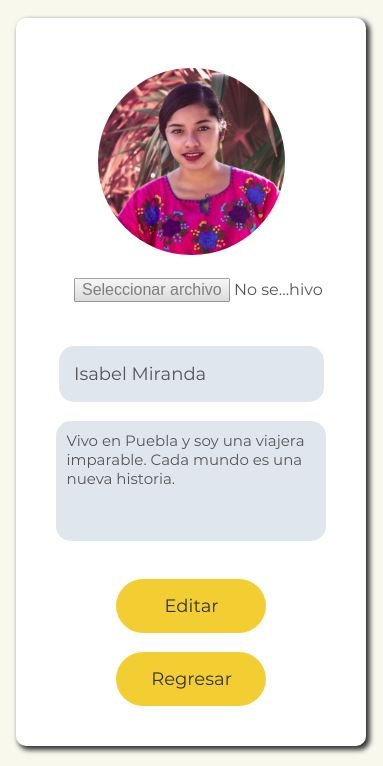

## Objetivos de aprendizaje | Herramientas de desarrollo implementadas

### HTML y CSS

* [x] [HTML semántico](https://developer.mozilla.org/en-US/docs/Glossary/Semantics#Semantics_in_HTML)
* [x] [CSS `flexbox`](https://css-tricks.com/snippets/css/a-guide-to-flexbox/)
* [x] Construir tu aplicación respetando el diseño realizado (maquetación).

### DOM y Web APIs

* [x] [Manipulación dinámica del DOM](https://developer.mozilla.org/es/docs/Referencia_DOM_de_Gecko/Introducci%C3%B3n)
* [ ] [History API](https://developer.mozilla.org/es/docs/DOM/Manipulando_el_historial_del_navegador)
* [ ] [`localStorage`]

### Javascript

* [x] [Uso de callbacks](https://developer.mozilla.org/es/docs/Glossary/Callback_function)
* [x] [Consumo de Promesas](https://scotch.io/tutorials/javascript-promises-for-dummies#toc-consuming-promises)
* [x] Uso ES modules
([`import`](https://developer.mozilla.org/en-US/docs/Web/JavaScript/Reference/Statements/import)
| [`export`](https://developer.mozilla.org/en-US/docs/Web/JavaScript/Reference/Statements/export))

### Firebase

* [x] [Firestore](https://firebase.google.com/docs/firestore)
* [x] [Firebase Auth](https://firebase.google.com/docs/auth/web/start)
* [ ] [Firebase security rules](https://firebase.google.com/docs/rules)
* [x] [Uso de onSnapshot](https://firebase.google.com/docs/firestore/query-data/listen)
| [onAuthStateChanged](https://firebase.google.com/docs/auth/web/start#set_an_authentication_state_observer_and_get_user_data)

### Testing

* [ ] [Testeo de tus funciones](https://jestjs.io/docs/es-ES/getting-started)
* [ ] [Testeo asíncrono](https://jestjs.io/docs/es-ES/asynchronous)
* [ ] [Mocking](https://jestjs.io/docs/es-ES/manual-mocks)

### Colaboración en Github

* [x] Branches
* [x] Pull Requests
* [ ] Tags

### Organización en Github

* [x] Projects
* [x] Issues
* [ ] Labels
* [ ] Milestones

### Buenas prácticas de desarrollo

* [x] Modularización
* [x] Nomenclatura / Semántica
* [ ] Linting

***
